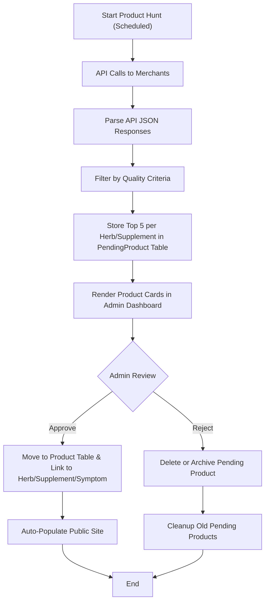

# TheNerveVine - Herbal Wellness & Automated Affiliate Marketing

## 🌿 Project Overview

TheNerveVine is a comprehensive herbal wellness platform that combines evidence-based natural health content with an automated affiliate marketing system. Our mission is to provide trustworthy, curated information about herbs, supplements, and natural remedies while generating sustainable income through ethical affiliate partnerships.

## 🎯 Core Purpose

### Educational & Ethical Framework
- **Evidence-Based Content**: All herbal and supplement information is thoroughly researched and scientifically grounded
- **Transparency**: Clear disclosure of affiliate relationships and revenue generation methods
- **Quality Curation**: Products are selected based on rigorous quality criteria, not just commission rates
- **User-First Approach**: Content and recommendations prioritize user health outcomes over profit

### Automated Income Generation
- **Low-Input Revenue**: Automated product sourcing reduces manual work while maintaining quality standards
- **Ethical Affiliate Marketing**: Partnerships only with companies that meet our quality and ethical standards
- **Sustainable Model**: Focus on long-term user trust and repeat engagement over short-term gains

## 🏗️ Technical Architecture

### Frontend
- **Framework**: Next.js 14 with TypeScript and React
- **Styling**: Tailwind CSS for responsive, modern design
- **Content**: Rich text editing with Tiptap for detailed herb/supplement descriptions

### Backend & Database
- **API Routes**: Next.js API routes for dynamic content and product management
- **Database**: Neon Postgres with Prisma ORM
- **Deployment**: Vercel for seamless CI/CD

### Content Management
- **Admin Interface**: Comprehensive content management system
- **Data Import/Export**: Automated systems for bulk content updates
- **Quality Control**: Admin-curated quality criteria for product selection

## 🔄 Automated Product Sourcing System

### API Integration Framework
- **Merchant APIs**: Automated integration with major supplement and wellness retailers
- **Quality Filtering**: Admin-defined criteria automatically filter products
- **Real-Time Updates**: Product availability and pricing updated automatically
- **Affiliate Link Generation**: Automated creation of tracked affiliate links

### Quality Criteria System
- **Ingredient Standards**: Products must meet specified ingredient quality requirements
- **Manufacturing Standards**: GMP compliance, third-party testing, etc.
- **Brand Reputation**: Historical performance and user satisfaction metrics
- **Price-Performance Ratio**: Value assessment relative to quality
- **Availability**: Stock levels and shipping reliability

### Admin Curation Process
1. **Criteria Definition**: Admins set quality thresholds and requirements
2. **Automated Filtering**: APIs automatically filter products based on criteria
3. **Manual Review**: Final approval of automated selections
4. **Performance Tracking**: Monitor conversion rates and user satisfaction

## 📊 Revenue Model

### Ethical Affiliate Marketing
- **Quality Over Commission**: Product selection based on quality, not commission rates
- **Transparent Disclosure**: Clear affiliate relationship disclosures
- **User Value Focus**: Recommendations prioritize user benefit over profit
- **Long-term Relationships**: Build trust through consistent quality

### Automated Systems
- **Product Discovery**: APIs automatically identify new qualifying products
- **Link Management**: Automated affiliate link generation and tracking
- **Performance Analytics**: Real-time tracking of conversion and revenue metrics
- **Optimization**: Data-driven improvements to product selection and presentation

## 🎨 User Experience

### Content Strategy
- **Comprehensive Guides**: Detailed herb and supplement information
- **Symptom-Based Recommendations**: Content organized by health concerns
- **Evidence-Based Approach**: Scientific backing for all recommendations
- **Accessible Language**: Complex information presented clearly

### Product Integration
- **Seamless Discovery**: Products naturally integrated into educational content
- **Quality Assurance**: All products meet established quality criteria
- **Transparent Pricing**: Clear pricing and availability information
- **User Reviews**: Integration of authentic user feedback

## 🛠️ Development Standards

### Code Quality
- **TypeScript**: Full type safety across the application
- **Best Practices**: Clean, maintainable code following industry standards
- **Testing**: Comprehensive testing before deployment
- **Documentation**: Clear code documentation and project guides

### Content Standards
- **Rich Descriptions**: Multi-paragraph, detailed product and herb descriptions
- **SEO Optimization**: Search engine optimized content structure
- **Accessibility**: WCAG compliant design and content
- **Mobile-First**: Responsive design for all devices

## 📈 Growth Strategy

### Phase 1: Foundation (Current)
- Complete merchant API framework implementation
- Establish quality criteria and curation processes
- Launch core content and product integration

### Phase 2: Expansion (3-6 months)
- Integrate additional merchant APIs
- Expand content library and product catalog
- Implement advanced analytics and optimization

### Phase 3: Optimization (6+ months)
- Data-driven product selection improvements
- Advanced user personalization
- Revenue optimization while maintaining quality standards

## 🤝 Contributing

### Content Guidelines
- All content must be evidence-based and thoroughly researched
- Product recommendations must meet established quality criteria
- Maintain transparency about affiliate relationships
- Prioritize user health outcomes over revenue

### Technical Guidelines
- Follow TypeScript best practices
- Maintain comprehensive documentation
- Test thoroughly before deployment
- Consider impact on existing features

## 📚 Documentation

- **DEV_NOTES.md**: Current development progress and next steps
- **USER_PROFILE.md**: User-specific context and preferences
- **cursorrules.md**: AI collaboration guidelines and coding standards
- **PROJECT_LOG.md**: Detailed technical decisions and changes

## 🚀 Getting Started

### Prerequisites
- Node.js 18+ 
- PostgreSQL database (Neon recommended)
- Vercel account for deployment

### Installation
```bash
# Clone the repository
git clone [repository-url]

# Install dependencies
npm install

# Set up environment variables
cp .env.example .env
# Edit .env with your database and API credentials

# Run database migrations
npx prisma migrate dev

# Start development server
npm run dev
```

### Environment Variables
- `DATABASE_URL`: PostgreSQL connection string
- `NEXTAUTH_SECRET`: Authentication secret
- Merchant API keys (as they become available)

## 📄 License

This project is proprietary and confidential. All rights reserved.

---

*TheNerveVine: Where evidence-based wellness meets ethical automation.*

## 🔍 Automated Product Hunt Workflow

TheNerveVine features a scheduled, admin-curated product hunt system that automates the discovery and curation of high-quality affiliate products from multiple merchant APIs. This process ensures only the best products, as defined by admin-set quality criteria, are considered for inclusion on the site.

### Workflow Overview



### Step-by-Step Explanation
1. **Start Product Hunt (Scheduled):** Every 1–2 weeks, the system initiates API calls to selected merchants.
2. **API Calls to Merchants:** Each merchant API returns a list of products in JSON format.
3. **Parse API JSON Responses:** The system parses and normalizes the product data.
4. **Filter by Quality Criteria:** Only products meeting or exceeding admin-defined quality standards are considered.
5. **Store Top 5 per Herb/Supplement:** The best 5 products per herb/supplement are stored in a temporary pending table for admin review.
6. **Render Product Cards in Admin Dashboard:** Admins see product cards for easy review and selection.
7. **Admin Review:** Admins approve or reject each product.
    - **Approve:** Product is moved to the main Product table and linked to the relevant herb, supplement, or symptom.
    - **Reject:** Product is deleted or archived.
8. **Auto-Populate Public Site:** Approved products automatically appear in the correct areas of the website.
9. **Cleanup Old Pending Products:** Unreviewed products are periodically cleaned up to minimize storage and compute costs.

This workflow ensures that only high-quality, admin-approved products are featured, while keeping the process efficient and scalable.
