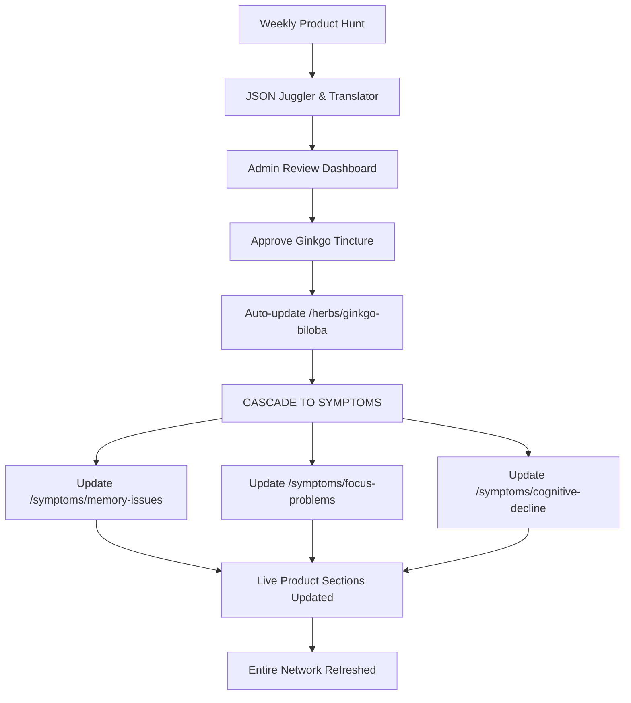

# TheNerveVine - Herbal Wellness & Automated Affiliate Marketing

## 🌿 Project Overview

TheNerveVine is a comprehensive herbal wellness platform that combines evidence-based natural health content with an automated affiliate marketing system. Our mission is to provide trustworthy, curated information about herbs, supplements, and natural remedies while generating sustainable income through ethical affiliate partnerships.

## 🎯 Core Purpose

### Educational & Ethical Framework
- **Evidence-Based Content**: All herbal and supplement information is thoroughly researched and scientifically grounded
- **Transparency**: Clear disclosure of affiliate relationships and revenue generation methods
- **Quality Curation**: Products are selected based on rigorous quality criteria, not just commission rates
- **User-First Approach**: Content and recommendations prioritize user health outcomes over profit

### Automated Income Generation
- **Low-Input Revenue**: Automated product sourcing reduces manual work while maintaining quality standards
- **Ethical Affiliate Marketing**: Partnerships only with companies that meet our quality and ethical standards
- **Sustainable Model**: Focus on long-term user trust and repeat engagement over short-term gains

## 🏗️ Technical Architecture

### Frontend
- **Framework**: Next.js 14 with TypeScript and React
- **Styling**: Tailwind CSS for responsive, modern design
- **Content**: Rich text editing with Tiptap for detailed herb/supplement descriptions

### Backend & Database
- **API Routes**: Next.js API routes for dynamic content and product management
- **Database**: Neon Postgres with Prisma ORM
- **Deployment**: Vercel for seamless CI/CD

### Content Management
- **Admin Interface**: Comprehensive content management system
- **Data Import/Export**: Automated systems for bulk content updates
- **Quality Control**: Admin-curated quality criteria for product selection

## 🌊 THE DOMINO RALLY CASCADE SYSTEM

### **The Revolutionary Content Network**

TheNerveVine features a sophisticated **cascade automation system** where one product approval creates a ripple effect across the entire content network. This is the heart of our automated affiliate marketplace.

### **🎯 Quality ↔ Revenue Spectrum Control**

Admins can adjust the system from "Quality over Revenue" to "Revenue at All Costs" using dynamic scoring weights:

```typescript
// Quality-focused (ethical sweet spot)
const scoringWeights = {
  qualityScore: 0.7,        // Prioritize product quality
  commissionRate: 0.2,      // Secondary consideration
  userReviews: 0.1         // User satisfaction
};

// Revenue-focused (maximum profit)
const scoringWeights = {
  qualityScore: 0.2,        // Minimum quality threshold
  commissionRate: 0.7,      // Maximize commissions
  availability: 0.1         // Stock considerations
};
```

### **🔄 The Cascade Flow**



### **📊 Content Hierarchy & Product Flow**

#### **For Each Herb:**
- **Traditional Formulations**: Tinctures, teas, powders
- **Phytoceuticals**: Standardized extracts, capsules
- **Quality Specifications**: Admin-defined criteria per formulation type

#### **For Each Symptom:**
- **Top 1-2 Recommended Herbs**: Primary therapeutic focus
- **Supporting Supplements**: Vitamins, minerals, oils (non-herbal)
- **Dynamic Product Population**: Automatically inherits from approved herb/supplement products

### **⚡ The Ripple Effect in Action**

**Phase 1: Product Approval & Herb/Supplement Population**
When an admin approves products, they first populate their respective herb/supplement pages:
- **Ginkgo tincture & standardized extract** → populate `/herbs/ginkgo-biloba` (Traditional & Modern formulations)
- **Lion's Mane double-fermented tincture & extract** → populate `/herbs/lions-mane` 
- **L-tyrosine high-strength vegi gelcaps** → populate `/supplements/l-tyrosine`

**Phase 2: Indication Assignment & Symptom Cascade**
When these herbs/supplements are assigned "Poor Memory" indication:
- All approved products from Ginkgo, Lion's Mane, and L-tyrosine cascade to `/symptoms/poor-memory`
- Evidence scores control product priority and order on symptom pages
- Prevents overpopulation by limiting products per symptom based on evidence scores

**Evidence Scoring System:**
- Evidence scores stored on relationship tables (HerbIndication, SupplementIndication)
- Same herb can have different evidence scores for different indications
- Example: Ginkgo + Memory (evidence: 90), Ginkgo + Anxiety (evidence: 60)
- Controls product priority and visibility on symptom pages

## 🔄 Automated Product Sourcing System

### API Integration Framework
- **Merchant APIs**: Automated integration with major supplement and wellness retailers
- **Quality Filtering**: Admin-defined criteria automatically filter products
- **Real-Time Updates**: Product availability and pricing updated automatically
- **Affiliate Link Generation**: Automated creation of tracked affiliate links

### Quality Criteria System
- **Ingredient Standards**: Products must meet specified ingredient quality requirements
- **Manufacturing Standards**: GMP compliance, third-party testing, etc.
- **Brand Reputation**: Historical performance and user satisfaction metrics
- **Price-Performance Ratio**: Value assessment relative to quality
- **Availability**: Stock levels and shipping reliability

### Admin Curation Process
1. **Criteria Definition**: Admins set quality thresholds and requirements
2. **Automated Filtering**: APIs automatically filter products based on criteria
3. **Manual Review**: Final approval of automated selections
4. **CASCADE ACTIVATION**: Approved products ripple through the entire network
5. **Performance Tracking**: Monitor conversion rates and user satisfaction

## 📊 Revenue Model

### Ethical Affiliate Marketing
- **Quality Over Commission**: Product selection based on quality, not commission rates
- **Transparent Disclosure**: Clear affiliate relationship disclosures
- **User Value Focus**: Recommendations prioritize user benefit over profit
- **Long-term Relationships**: Build trust through consistent quality

### Automated Systems
- **Product Discovery**: APIs automatically identify new qualifying products
- **Link Management**: Automated affiliate link generation and tracking
- **Performance Analytics**: Real-time tracking of conversion and revenue metrics
- **Optimization**: Data-driven improvements to product selection and presentation

## 🎨 User Experience

### Content Strategy
- **Comprehensive Guides**: Detailed herb and supplement information
- **Symptom-Based Recommendations**: Content organized by health concerns
- **Evidence-Based Approach**: Scientific backing for all recommendations
- **Accessible Language**: Complex information presented clearly

### Product Integration
- **Seamless Discovery**: Products naturally integrated into educational content
- **Quality Assurance**: All products meet established quality criteria
- **Transparent Pricing**: Clear pricing and availability information
- **User Reviews**: Integration of authentic user feedback

### Product Display Strategy
- **No Scraped Descriptions**: Eliminates inconsistent, messy product descriptions that vary in quality and length
- **Quality Specifications Display**: Shows our curated quality criteria (purity, testing, sourcing) instead of generic product descriptions
- **Uniform Card Layouts**: Consistent, professional appearance across all product cards
- **Our Expertise Showcase**: Displays our research-backed substance descriptions and quality standards
- **Clean Presentation**: Focuses on what users actually care about - quality, consistency, and professional appearance

## 🛠️ Development Standards

### Code Quality
- **TypeScript**: Full type safety across the application
- **Best Practices**: Clean, maintainable code following industry standards
- **Testing**: Comprehensive testing before deployment
- **Documentation**: Clear code documentation and project guides

### Content Standards
- **Rich Descriptions**: Multi-paragraph, detailed product and herb descriptions
- **SEO Optimization**: Search engine optimized content structure
- **Accessibility**: WCAG compliant design and content
- **Mobile-First**: Responsive design for all devices

## 📈 Growth Strategy

### Phase 1: Foundation (Current)
- Complete merchant API framework implementation
- Establish quality criteria and curation processes
- Launch core content and product integration

### Phase 2: Expansion (3-6 months)
- Integrate additional merchant APIs
- Expand content library and product catalog
- Implement advanced analytics and optimization

### Phase 3: Optimization (6+ months)
- Data-driven product selection improvements
- Advanced user personalization
- Revenue optimization while maintaining quality standards

## 🤝 Contributing

### Content Guidelines
- All content must be evidence-based and thoroughly researched
- Product recommendations must meet established quality criteria
- Maintain transparency about affiliate relationships
- Prioritize user health outcomes over revenue

### Technical Guidelines
- Follow TypeScript best practices
- Maintain comprehensive documentation
- Test thoroughly before deployment
- Consider impact on existing features

## 📚 Documentation

- **DEV_NOTES.md**: Current development progress and next steps
- **USER_PROFILE.md**: User-specific context and preferences
- **cursorrules.md**: AI collaboration guidelines and coding standards
- **PROJECT_LOG.md**: Detailed technical decisions and changes

## 🚀 Getting Started

### Prerequisites
- Node.js 18+ 
- PostgreSQL database (Neon recommended)
- Vercel account for deployment

### Installation
```bash
# Clone the repository
git clone [repository-url]

# Install dependencies
npm install

# Set up environment variables
cp .env.example .env
# Edit .env with your database and API credentials

# Run database migrations
npx prisma migrate dev

# Start development server
npm run dev
```

### Environment Variables
- `DATABASE_URL`: PostgreSQL connection string
- `NEXTAUTH_SECRET`: Authentication secret
- Merchant API keys (as they become available)

## 📄 License

This project is proprietary and confidential. All rights reserved.

---

*TheNerveVine: Where evidence-based wellness meets ethical automation.*
